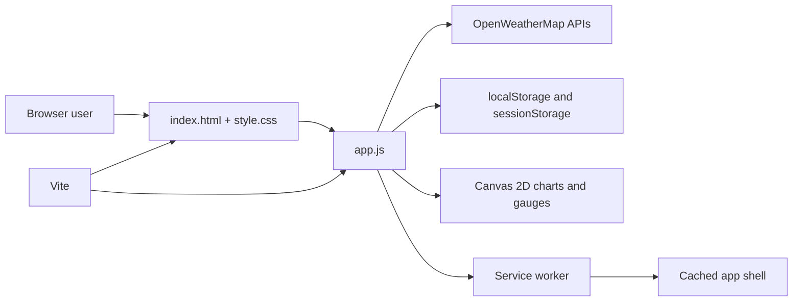

<a name="top"></a>

# Atmosphere

> A focused weather dashboard that turns live conditions into a calm, visual experience.

[](https://vitejs.dev/)
[](https://developer.mozilla.org/en-US/docs/Web/JavaScript)
[](#license)
[](https://atmosphere-data.vercel.app)

[Live demo](https://atmosphere-data.vercel.app) · [Report a bug](https://github.com/vincenzo-afk/Atmosphere/issues/new?template=bug_report.md) · [Request a feature](https://github.com/vincenzo-afk/Atmosphere/issues/new?template=feature_request.md) · [Security policy](SECURITY.md)

## Table of contents

- [About the project](#about-the-project)
- [Tech stack](#tech-stack)
- [Getting started](#getting-started)
- [Usage](#usage)
- [Weather-data integration](#weather-data-integration)
- [Project structure](#project-structure)
- [Features and roadmap](#features-and-roadmap)
- [Testing](#testing)
- [Deployment](#deployment)
- [Contributing](#contributing)
- [Security](#security)
- [License](#license)
- [Acknowledgments](#acknowledgments)

---

## <a name="about-the-project"></a>About the project

Atmosphere is a client-side weather dashboard for searching cities and viewing current conditions, forecasts, air-quality measurements, astronomical information, weather history, alerts, and practical guidance. It uses a small Vite build with plain HTML, CSS, and JavaScript rather than a frontend framework or runtime backend.

The interface is designed to keep a large amount of weather information readable. Current conditions are presented in a hero card, quantitative details use canvas-based charts and gauges, and the dashboard adapts its background treatment to the current weather condition. Personal preferences, recent searches, favorites, cached responses, and short weather history are stored locally in the browser.

### Key capabilities

- Search cities with debounced geocoding suggestions and browser geolocation.
- View current temperature, feels-like temperature, humidity, wind, visibility, pressure, sunrise, and sunset.
- Explore an hourly temperature and precipitation-probability chart.
- Expand five-day forecast cards to inspect three-hour intervals.
- Review air-quality index and pollutant measurements.
- Inspect sun travel, golden-hour timing, moon phase, weather history, and daily clothing guidance.
- Receive locally generated severe-weather and air-quality alerts.
- Switch temperature, wind, pressure, time, and theme preferences.
- Save favorite cities, export/import local data, reset local data, and share city links.
- Install the application and use the cached app shell offline in browsers that support Progressive Web App (PWA) features.

### Screenshots and live preview

The hosted preview is available at [atmosphere-data.vercel.app](https://atmosphere-data.vercel.app). The dashboard requires a valid OpenWeatherMap API key for live requests; cached data and the app shell remain available only after they have been created in the browser.

### Architecture



The application has no project-owned HTTP API or database. OpenWeatherMap is called directly from the browser, and the API key is supplied through Vite environment replacement during development and builds.

---

## <a name="tech-stack"></a>Tech stack

| Area | Verified implementation |
|---|---|
| Frontend | Semantic HTML, CSS, and JavaScript using ES modules |
| Build tool | Vite `^5.0.0` for development and production bundling |
| Visualizations | Browser Canvas 2D API; no charting library |
| Browser storage | `localStorage` for settings, cache, recent searches, favorites, and history; `sessionStorage` for dismissed alerts |
| Offline/installability | Service Worker API, Web App Manifest, Cache Storage API, and browser install prompt |
| External integration | OpenWeatherMap Current Weather, Forecast, Air Pollution, UV, Direct Geocoding, Reverse Geocoding, and weather icons |
| Deployment | Existing live deployment at Vercel: `https://atmosphere-data.vercel.app` |
| Runtime backend | None in this repository |

The production browser bundle has no application runtime dependency beyond standard browser APIs. Vite is the only declared development dependency in `package.json`.

---

## <a name="getting-started"></a>Getting started

### Prerequisites

Install a current Node.js release with npm. A modern browser is required for the full experience. Canvas 2D, Fetch, and ES modules are required; geolocation, clipboard, Web Share, service workers, and installation are progressive enhancements.

You also need an OpenWeatherMap account and API key for live weather requests. The repository reads the key from `VITE_OPENWEATHER_API_KEY`.

### Installation

```bash
git clone https://github.com/vincenzo-afk/Atmosphere.git
cd Atmosphere
npm install
```

Create a local environment file from the repository template:

```bash
cp .env.example .env
```

Set the value in `.env`:

```dotenv
VITE_OPENWEATHER_API_KEY=your_api_key_here
```

Start the development server:

```bash
npm run dev
```

To create a production bundle:

```bash
npm run build
```

To serve the generated build using Vite’s preview server:

```bash
npm run preview
```

### Configuration

| Variable | Required | Description |
|---|---:|---|
| `VITE_OPENWEATHER_API_KEY` | Yes for live data | OpenWeatherMap API key exposed to the client-side Vite bundle |

Do not commit `.env` files or API keys. The existing `.gitignore` excludes `.env`, `.env.local`, and other local environment variants.

---

## <a name="usage"></a>Usage

Open Atmosphere through the development or preview URL, enter a city in the search field, and press `Enter`. Select a geocoding suggestion when it appears, or use **Use My Location** when the browser grants location access.

After a city loads, use the dashboard controls to change units, open Settings, refresh the data, save the current city as a favorite, or open the share modal. Settings are stored on the current browser and do not require an account.

### Keyboard shortcuts

| Shortcut | Action |
|---|---|
| `/` | Focus the city search field |
| `Esc` | Close panels, dialogs, and autocomplete |
| `F` | Toggle temperature units |
| `R` | Refresh the current city |
| `L` | Toggle the selected light/dark theme |
| `H` | Scroll to weather history |
| `Ctrl+K` or `Cmd+K` | Open the shortcut palette |

### Local data controls

The Settings panel provides the following local-first controls:

- **Favorite cities:** Save and load up to twelve cities.
- **Export Settings & Places:** Download settings, favorites, recent searches, history, and cached responses as a versioned JSON file.
- **Import Settings & Places:** Restore supported values from an Atmosphere backup file.
- **Reset Local Data:** Remove locally stored Atmosphere data after confirmation.
- **Copy City Link:** Create a URL containing the selected city in the hash fragment.
- **Share:** Use the browser’s native share sheet when supported.

---

## <a name="weather-data-integration"></a>Weather-data integration

Atmosphere calls the following OpenWeatherMap endpoints directly from `app.js`:

| Service | Endpoint | Purpose |
|---|---|---|
| Current weather | `/data/2.5/weather` | Current conditions and coordinates |
| Forecast | `/data/2.5/forecast` | Five-day forecast in three-hour intervals |
| Air pollution | `/data/2.5/air_pollution` | Air-quality index and pollutant components |
| UV index | `/data/2.5/uvi` | Current ultraviolet index |
| Direct geocoding | `/geo/1.0/direct` | City name to coordinates and location suggestions |
| Reverse geocoding | `/geo/1.0/reverse` | Browser coordinates to a city name |
| Weather icon | `https://openweathermap.org/img/wn/{icon}@2x.png` | Condition icon displayed in the hero card |

All calls use the `VITE_OPENWEATHER_API_KEY` environment variable. The application provides user-facing handling for missing or invalid keys, city-not-found responses, rate limits, network errors, offline mode, and denied geolocation.

This repository does not expose a server-side proxy, so the key is delivered to the browser by design. Use an API key policy and quota appropriate for a public client-side application.

---

## <a name="project-structure"></a>Project structure

```text
Atmosphere/
├── app.js                         # API calls, state, rendering, charts, storage, and event handlers
├── index.html                     # Dashboard markup, dialogs, settings, and PWA links
├── style.css                      # Themes, layout, responsive rules, animations, and print styles
├── package.json                   # Vite scripts and development dependency
├── package-lock.json              # npm dependency lockfile
├── .env.example                   # Required Vite environment variable template
├── .github/
│   ├── dependabot.yml             # Weekly npm dependency update configuration
│   ├── pull_request_template.md   # Pull-request checklist
│   ├── ISSUE_TEMPLATE/            # Bug and feature-request forms
│   └── workflows/ci.yml           # npm test and production-build verification
├── public/
│   ├── googlebd395c84086f0059.html # Existing Google Search Console verification file
│   ├── icon.svg                   # Installable app icon
│   ├── manifest.webmanifest       # PWA metadata
│   ├── og-image.png               # Social preview image
│   ├── robots.txt                 # Crawler directives
│   ├── sitemap.xml                # Sitemap for the hosted homepage
│   └── sw.js                      # App-shell service worker
├── tests/
│   └── feature-smoke.test.mjs     # Dependency-free repository smoke tests
├── CODE_OF_CONDUCT.md             # Contributor Covenant-based conduct policy
├── CONTRIBUTING.md                # Setup and pull-request guidance
├── SECURITY.md                    # Vulnerability-reporting policy
└── README.md                      # Project documentation
```

---

## <a name="features-and-roadmap"></a>Features and roadmap

### Current features

- [x] Current weather, five-day forecast, hourly forecast, air quality, UV index, sun, moon, history, alerts, and clothing guidance.
- [x] City search, debounced suggestions, recent searches, and browser geolocation.
- [x] Dark, light, and system theme preferences with unit and time-format settings.
- [x] Local cache fallback and offline status messaging.
- [x] Favorites, local JSON backup/restore, reset controls, share links, and native sharing.
- [x] Installable PWA metadata and a cached app shell.
- [x] Canvas-based visualizations with responsive resizing.
- [x] Dependency-free smoke tests and Vite production builds.

### Known limitations

- Live weather requests require a user-provided OpenWeatherMap API key.
- Weather API quotas, endpoint availability, and data freshness are controlled by OpenWeatherMap.
- Data is stored per browser and is not synchronized between devices.
- The service worker caches the app shell; live weather data still requires a network connection unless a matching local cache exists.
- Native sharing, clipboard operations, geolocation, installation, and service workers depend on browser support and secure-context rules.

### Roadmap

Potential future work should remain aligned with the current static architecture: improve data validation and browser compatibility, expand automated browser coverage, and add optional client-side visualizations without introducing an unnecessary backend or paid runtime service.

See the repository’s [commit history](https://github.com/vincenzo-afk/Atmosphere/commits/main) for completed changes and the [issues page](https://github.com/vincenzo-afk/Atmosphere/issues) for active discussion.

---

## <a name="testing"></a>Testing

Run the repository’s dependency-free smoke tests:

```bash
npm test
```

The tests verify that the primary new controls are present, PWA metadata and service-worker hooks are linked, and the core local-first feature functions remain wired into `app.js`.

Run the production build check:

```bash
npm run build
```

The GitHub Actions workflow in `.github/workflows/ci.yml` runs `npm ci`, `npm test`, and `npm run build` on Node.js 20 for pushes and pull requests targeting `main`. Dependabot is configured for weekly npm dependency updates. No coverage tool, lint script, or end-to-end browser suite is currently configured. Manual browser verification should include a clean profile, mobile and desktop layouts, keyboard navigation, theme switching, import/export, offline reload behavior, and a browser with optional APIs unavailable.

---

## <a name="deployment"></a>Deployment

The repository includes a live Vercel deployment at [atmosphere-data.vercel.app](https://atmosphere-data.vercel.app). The source tree does not include a Vercel project configuration file, so deployment settings are managed by the hosting project rather than committed here.

For a static Vercel deployment, use the repository root as the project directory, configure `VITE_OPENWEATHER_API_KEY` as an environment variable, and use the following commands from `package.json`:

| Setting | Value |
|---|---|
| Install command | `npm install` |
| Build command | `npm run build` |
| Output directory | `dist` |
| Environment variable | `VITE_OPENWEATHER_API_KEY` |

A different static host can serve the generated `dist/` directory. Service workers and the install prompt require HTTPS or a supported local development origin; direct `file://` opening is not equivalent to a hosted deployment.

---

## <a name="contributing"></a>Contributing

Contributions are welcome. Please read [CONTRIBUTING.md](CONTRIBUTING.md) and [CODE_OF_CONDUCT.md](CODE_OF_CONDUCT.md) before opening a pull request.

For changes:

1. Fork the repository or create a topic branch.
2. Install dependencies with `npm install`.
3. Run `npm test` and `npm run build`.
4. Describe the user-facing change, test coverage, and any API or storage impact.
5. Open a pull request using the repository template.

Keep changes focused, preserve the vanilla HTML/CSS/JavaScript architecture, avoid committing secrets or generated output, and update the README when commands or behavior change. Use concise imperative commit messages; Conventional Commit prefixes are encouraged but not enforced by the current repository configuration.

---

## <a name="security"></a>Security

Read [SECURITY.md](SECURITY.md) for the private vulnerability-reporting path and supported-version policy.

The OpenWeatherMap API key is a client-side build variable, not a server-side secret in this architecture. Never commit `.env` files, real keys, or exported browser data. Review imported JSON before restoring it, and keep browser permissions such as geolocation disabled unless needed.

---

## <a name="license"></a>License

No `LICENSE` file is currently present in this repository. Copyright and redistribution terms are therefore not explicitly granted by the project at this time. Add a license file with the repository owner’s chosen terms before publishing the project for reuse.

---

## <a name="acknowledgments"></a>Acknowledgments

- Weather data and geocoding are provided by [OpenWeatherMap](https://openweathermap.org/).
- The build pipeline uses [Vite](https://vitejs.dev/).
- The interface uses standard browser APIs including Canvas 2D, Fetch, local storage, Cache Storage, service workers, and the Web App Manifest.
- The project’s visual direction is described in the source as Notion-inspired.

---

## References

[1]: https://github.com/vincenzo-afk/Atmosphere "Atmosphere on GitHub"
[2]: https://openweathermap.org/api "OpenWeatherMap API documentation"
[3]: https://vitejs.dev/guide/ "Vite documentation"
[4]: https://developer.mozilla.org/en-US/docs/Web/Progressive_web_apps "MDN Progressive Web Apps"

[GitHub](https://github.com/vincenzo-afk/Atmosphere) · [Live website](https://atmosphere-data.vercel.app) · [Issues](https://github.com/vincenzo-afk/Atmosphere/issues)

Built with vanilla JavaScript by [vincenzo-afk](https://github.com/vincenzo-afk).

<p align="right">[Back to top](#top)</p>
